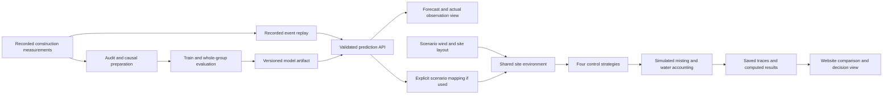

# Model and software prototype architecture

This remains the integration contract. Preparation, the trained artifact and its evaluation are complete; API/replay, website and site control remain to be implemented.

## Components and data flow



The measured-data replay verifies prediction against later recorded measurements. The site experiment illustrates a proposed intervention under declared assumptions. A near-source concentration forecast is not automatically a boundary forecast or an emission-rate estimate. Mapping between these requires a named, documented approximation and separate evaluation.

## Planned repository layout

```text
apps/web/                  React/TypeScript website
services/inference/        Validated local prediction service
src/dusttwin/              Shared Python features, training and evaluation
scripts/                   Dataset acquisition and repeatable commands
configs/                   Dataset, split, feature and model settings
data/manifest.json         Source versions, hashes and units
data/raw/                  Local downloads; ignored
data/processed/            Local prepared records; ignored
models/model-card.md       Artifact identity, metrics and limitations
models/artifacts/          Local fitted artifacts; ignored
experiments/scenarios/     Declared site-control scenarios
reports/                   Small metrics and eligible prediction traces
tests/                     Focused leakage, inference and accounting checks
docs/                      Audits, decisions and presentation evidence
```

These directories will be added as implementation creates real contents. Save large artifacts outside ordinary Git; before Round 1 provide a checksum-addressed downloadable artifact or a GitHub release asset plus local offline copy. Keep dataset terms with the manifest.

## Prediction service contract

Initial implementation choice: Python with scikit-learn and FastAPI; freeze exact installed versions and a lockfile at implementation. The service loads one vetted local model artifact at startup. Do not load arbitrary client-supplied model files. Inference calls the same causal feature builder used during training.

`GET /health` reports readiness, model ID, artifact SHA-256, supported dataset/task, horizon and native interval.

`POST /v1/predict` accepts the model task ID, monitor ID, clock type, issue time and past measurement history. Example fields are:

```json
{
  "task_id": "construction_pm10_30s_v1",
  "monitor_id": "audited_monitor_id",
  "clock_type": "elapsed_seconds",
  "issue_time_seconds": 600,
  "history": [{"time_seconds": 598, "pm10_ug_m3": 120.0}]
}
```

The example shows field names, not a complete valid history. Actual inputs need the frozen lookback/cadence. Include measured optional PM2.5 or weather fields only after the accepted feature schema supports them. Weather supplied solely for the site scenario is passed to the simulation engine, not secretly added to the trained model.

The response contains model/artifact ID, dataset/source ID, issue and target time, horizon, predicted PM10, baseline predictions, input-quality flags and scope limitations. It contains no current request's future ground truth. Replay reveals actual targets only when replay time reaches them. No confidence field is populated without a documented calibration method.

Reject nonfinite values, duplicate/out-of-order timestamps, unsupported horizons, wrong units and insufficient history with specific errors. Gaps use the frozen missing-data policy. Unavailable inference produces an explicit unavailable state; an optional fallback baseline must be labelled separately.

## Website behavior

The frontend maintains one committed scenario/replay state. “Apply” either commits draft changes or is removed in favor of immediate updates. Responses are associated with their input snapshot and stale requests are discarded. The prediction service's returned output owns model forecast values, rather than direct calls to the old mock engine.

Required judge views:

1. Dataset and model card: source, task, native cadence, horizon, split and test metrics.
2. Measured replay: PM history, trained-model forecast, persistence, later actual observations and errors.
3. Site simulation: declared wind, layout, boundaries, zone commands, unavailable-data status and trace-based water/exposure comparisons.
4. Proposed physical architecture: labelled Round 2 design and cost assumptions.

Real observations, learned predictions and simulated outcomes get persistent distinct labels. A replay can run faster than real time, but its clock must say “recorded elapsed time” and display playback speed. Ambient hourly data, if used, gets a separate hourly task and clock; never display its forecast as a 30-second construction forecast.

## Site control contract

Use A=north, B=east, C=south and D=west everywhere. Clearly distinguish meteorological wind-from direction from plume-travel direction at the input adapter. Keep background and source contribution separate, and specify the geometric/transport approximation. Forecast-aware zone release and reactivation use common minimum on/off intervals and pump capacity limits across controllers.

A controller receives only current/past observations and available forecasts. It does not read future source/weather events from the replay file. The environment runner owns future events; measurements are exposed as time advances. Predicted crossing time comes from an identified trajectory model, not a perpetual distance/speed value.

## Offline and integration checks

The trained artifact and a permitted replay fixture are available locally. Start the API and website with documented commands. Export or serve a replayable evidence packet for a local static fallback, labelled as saved inference results if the API is unavailable. Network access is not required for the rehearsed presentation.

Check one known input snapshot through training/evaluation, API and browser paths; values must agree. Verify pause/reset, strategy isolation, units, model-unavailable behavior and chart/trace agreement. Follow existing source reuse permission before importing the reviewed frontend. The fitted model is complete; API/browser agreement and offline website rehearsal remain unverified until those components exist.

Primary implementation references: [scikit-learn time-series splits](https://scikit-learn.org/stable/modules/generated/sklearn.model_selection.TimeSeriesSplit.html), [gradient boosting regressor](https://scikit-learn.org/stable/modules/generated/sklearn.ensemble.HistGradientBoostingRegressor.html), and [FastAPI request bodies](https://fastapi.tiangolo.com/tutorial/body/).
